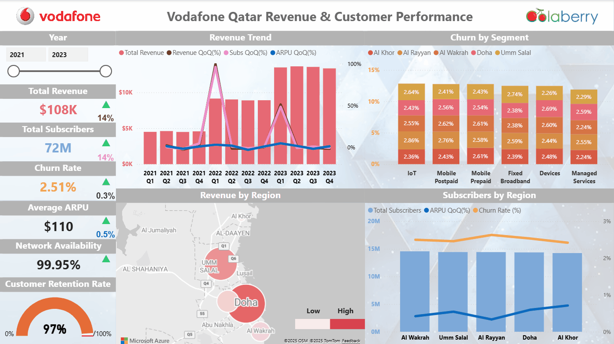

# Revenue Forecasting and Performance Analysis of Vodafone Qatar (2021–2023)

## Project Summary

This project leverages advanced analytics to transform Vodafone Qatar's telecom data into a unified, ML-ready foundation, enabling telecom leaders to predict revenue shifts and optimize strategic decisions.

---

## Business Problem

Telecom revenue performance is fragmented across regions and segments, hindering accurate forecasting and risk management.

---

## Objective

- Improve revenue forecasting accuracy for proactive planning
- Identify key drivers of churn and customer retention
- Develop a scalable data foundation for machine learning insights

---

## Tools & Technologies

- Python
- NexusMax
- Microsoft Fabric
- Power BI
- Pandas
- ETL Pipelines
- Data Visualization Tools

---

## Project Workflow

- Data ingestion and cleaning from raw Vodafone datasets
- Feature engineering and normalization for analytical readiness
- Model development and training using supervised learning techniques
- Integration of enriched data into a centralized Power BI dashboard
- Visualization of trends and key performance indicators

---

## Key Insights

- The dataset reveals significant regional and segment-level variations in revenue and churn.
- Network reliability and subscriber growth patterns provide actionable forecasting signals.
- High network availability supports stable performance, but certain segments face persistent churn.

---

## Final Dashboard / Project Preview

---

## Business Impact

- Enables finance and strategy teams to make data-driven decisions with reduced uncertainty.
- Facilitates targeted retention strategies to lower unexpected revenue losses.
- Supports long-term planning by highlighting high-growth and high-risk segments.

---

## Portfolio Navigation

[← Back to Portfolio Home](../README.md)
